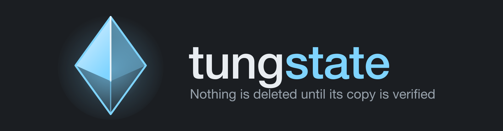

  

A reconciliation controller for filesystems.

You declare the shape a folder should have. Tungstate watches it, detects drift
(misplaced files, naming violations, duplicates) and reconciles it safely and
continuously. It also moves files between machines durably: copy one, verify it,
delete the source, reclaim the space, next file, surviving sleep and network loss.

Status: early construction. The durable drain works: `tungstate link add <from> <to> --name x --move` then `tungstate link run x`, resumable after a crash. Governance is next. See `docs/DESIGN.md` for the full design and
`docs/SYLLABUS.md` for the build order.

Licensed under either of Apache License, Version 2.0 or MIT license at your option.

## The name

Tungsten is element 74, `W`. A **tungstate** is the WO₄²⁻ anion, and *scheelite*
is calcium tungstate, CaWO₄: a dense grey mineral that fluoresces bright
blue-white under ultraviolet light.

That is where the whole visual identity comes from. The mark is scheelite's
crystal habit, a tetragonal bipyramid, and the interface is mineral grey with a
single fluorescent accent reserved for the file being verified right now.
